# Resilient Web Application with Auto Scaling (Azure)

A scalable Microsoft Azure deployment hosting a simple institutional portal
(**Byte Academy**): students view class materials and post activities. The app runs behind a
**Load Balancer**, on a **VM Scale Set with auto scaling**, backed by a **managed database**
(MySQL) and **object storage** (Blob), all inside a virtual network with public and private
subnets.

The infrastructure is provisioned as code (**Terraform**), with an alternative **Azure CLI**
path documented under `scripts/` and `docs/roteiro.md`.

## Architecture

```
Internet →
  Public IP (Standard) →
      Load Balancer (Standard) →
          VM Scale Set (autoscale 1→2, public subnet)
                    ├─ MySQL Flexible Server (private subnet, no public IP)
                    └─ Blob Storage (class materials, read via Managed Identity)
```

Region: **West US 2**.

## Azure services used

Virtual Network, public and private subnets, VM Scale Set, Standard Load Balancer,
Azure Database for MySQL Flexible Server, Blob Storage, Network Security Groups,
Azure Monitor (auto scaling), Managed Identity.

## How it works

1. The user hits the **Load Balancer's public IP** (port 80).
2. The LB distributes requests across the **VM Scale Set** instances (port 8080) and uses a
   health check on `/health`.
3. The app lists materials from **Blob Storage** (via Managed Identity, no keys) and
   writes/lists activities in the managed **MySQL** (private access, not exposed to the internet).
4. **Auto scaling** grows from 1 to 2 instances when CPU exceeds 70% (capped by the
   subscription's 4-vCPU quota).
5. Each page shows **which instance responded** — evidence of load balancing.

## Repository structure

```
.
├── app/          # Node.js (Express) application — see app/README.md
├── infra/        # cloud-init.yaml that provisions the app on the VMSS
├── terraform/    # infrastructure as code (Terraform) — see terraform/README.md
├── scripts/      # provisioning via Azure CLI (bash and PowerShell)
├── diagrama/     # architecture diagram (draw.io + PNG)
├── docs/         # full walkthrough + technical and cost reports
└── evidencias/   # evaluation screenshots (sensitive IDs redacted)
```

## How to provision (quick start)

Prerequisites: an Azure account (free account), **Terraform** (or **Azure CLI**) and **Git**.

**Terraform (recommended):**

```
cd terraform
cp terraform.tfvars.example terraform.tfvars   # fill in your values
terraform init
terraform plan
terraform apply
```

**Azure CLI (alternative):**

```
az login
# set your variables and the DB password (see scripts/)
bash scripts/provision.sh        # or: pwsh scripts/provision.ps1
```

The detailed, step-by-step guide is in `docs/roteiro.md`.

## Evidence

> Subscription IDs were redacted from the screenshots for security.

### Infrastructure provisioned as code (Terraform)

`terraform apply` completing, with outputs and a live health/DB check:

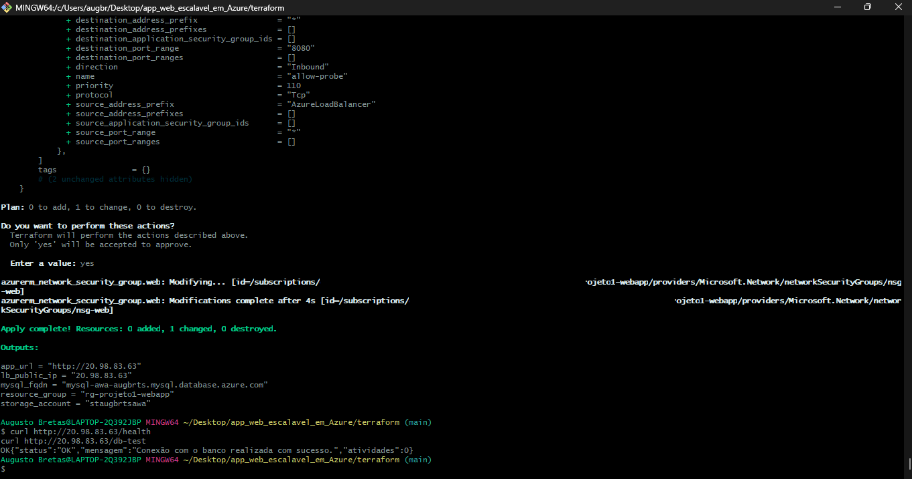

Resources tracked in Terraform state:

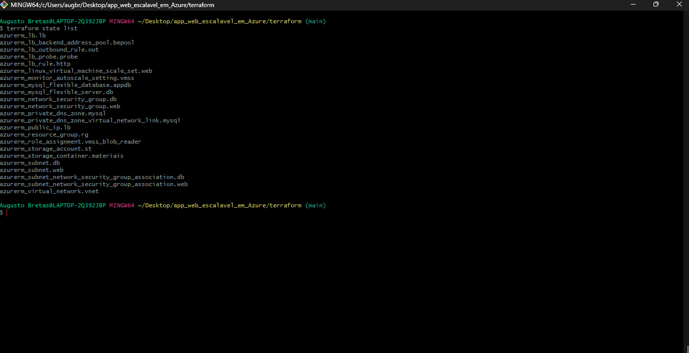

### Application reachable via the Load Balancer

The app served through the Load Balancer's public IP, showing the responding instance in the footer:

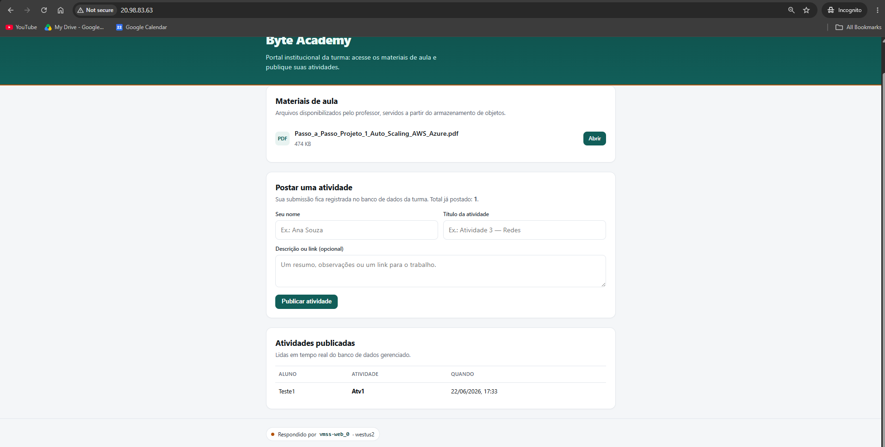

Reloading hits a different instance (`vmss-web_1`) — proof of load balancing:

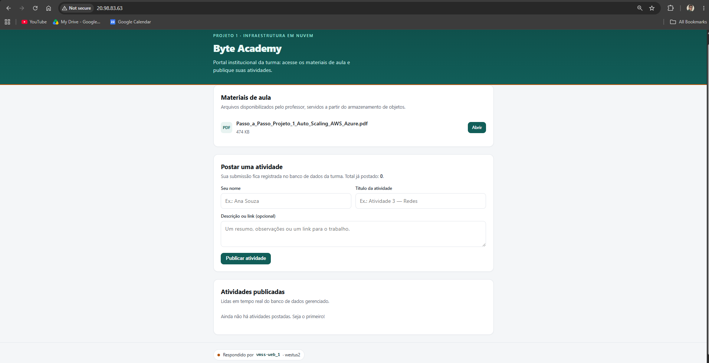

Instances registered in the Load Balancer backend pool:

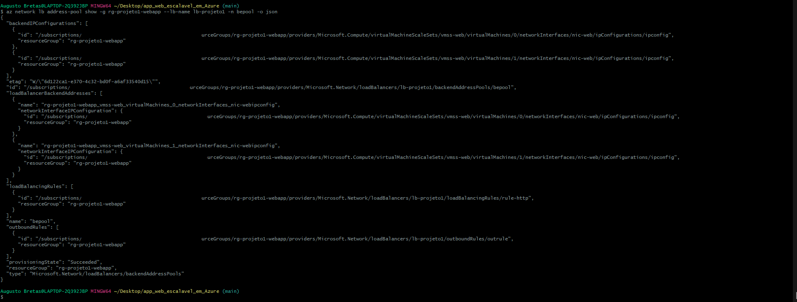

### Managed database (MySQL) in use

An activity submitted through the form and listed back from the managed MySQL:

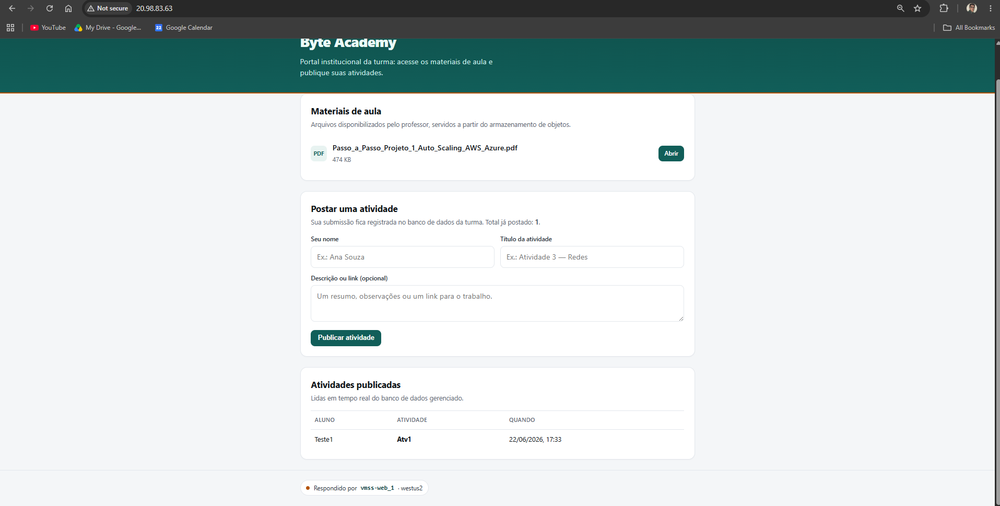

### Object storage (Blob) in use

Files in the `materiais` container, listed via CLI:

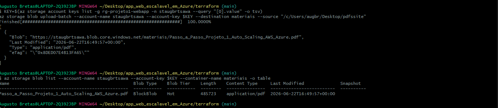

Downloading a class material served from Blob (via Managed Identity):

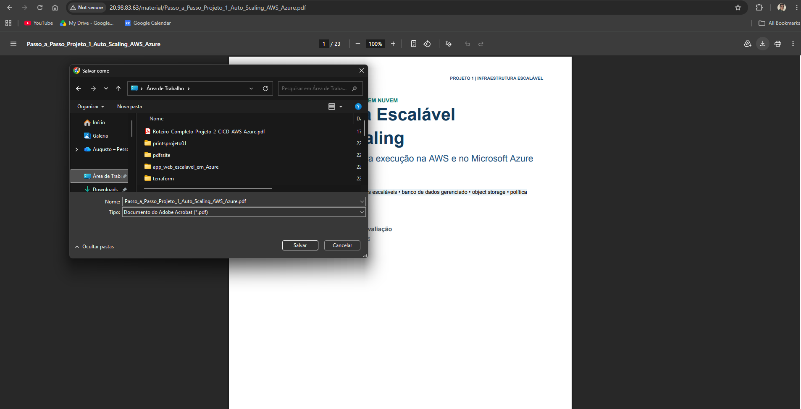

### Auto scaling

Auto scaling policy configured (CPU 70% / 30%):

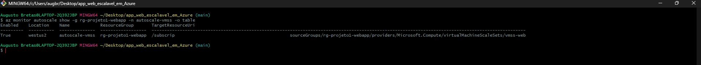

Full scaling cycle in the **Azure Activity Log** — `Scaleup/Action` under load and
`Scaledown/Action` after CPU drops (stronger evidence than a single snapshot):

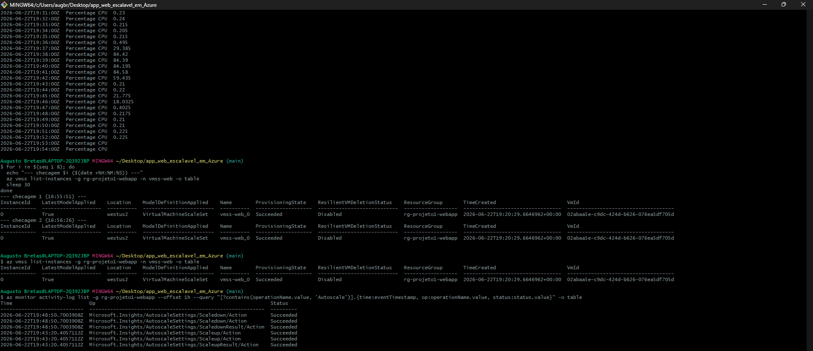

### Cleanup

`terraform destroy` tearing everything down — *Destroy complete! Resources: 23 destroyed*:

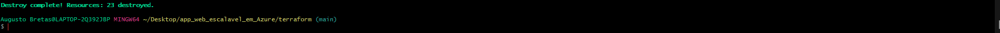

## Cost

The solution was sized for the lowest possible cost: MySQL `B1ms` (burstable, free tier),
`LRS` storage, no zonal high availability, and internet egress via the Load Balancer outbound
rule (avoiding NAT Gateway costs). The web tier uses `D2s_v3` — the Burstable series (cheaper)
was the initial choice but hit capacity restrictions in the region, so `D2s_v3` was the
available SKU. The monthly estimate and assumptions are in `docs/relatorio-custos.md`.

## Cleanup

```
terraform destroy        # if provisioned via Terraform
# or, if provisioned via CLI:
az group delete --name rg-projeto1-webapp --yes --no-wait
```

## Best practices applied

- Managed database with **no public endpoint** (reachable only inside the virtual network).
- **Managed Identity** to read Blob (no storage keys in code).
- **Restrictive NSGs**: 80 public, 8080 for Load Balancer traffic, 3306 internal only.
- **No secrets in the repository** (`.env`, `terraform.tfvars` and the filled cloud-init stay out of Git).
- App runs as a non-privileged user, with parameterized queries and HTML escaping.

---

*Academic demonstration web application.*
